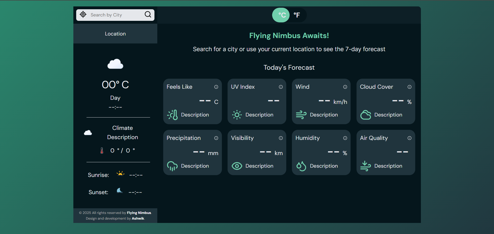
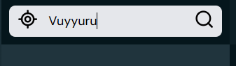
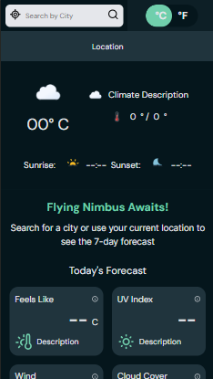

# 🌤️ Flying Nimbus - Advanced Weather Application


A sophisticated weather application built with vanilla JavaScript featuring real-time updates and modern responsive design. Demonstrates advanced frontend development skills including smart data management and performance optimization.

## 🚀 Key Features

- **7-Day Forecast & Hourly Data** - Complete weather overview with detailed hourly breakdowns
- **Unlimited API Calls** - No caching required (Open-Meteo allows free unlimited requests)
- **Real-time Updates** - Auto-updating clock with timezone support, background data refresh
- **Interactive UI** - Smooth animated temperature toggle (°C/°F), responsive across all devices
- **Advanced Metrics** - Air quality index, comprehensive forecast cards
- **Geolocation Support** - Auto-detect user location or search any city worldwide

## 📸 Screenshots

### 🏠 Dashboard / Home Screen



### 🔍 Search by City or Place or Geolocation



### 📱 Mobile Responsive Layout



## 🛠️ Technologies & Architecture

- **Frontend**: Vanilla JavaScript (ES6+), HTML5, CSS3/SCSS
- **Pattern**: MVC Architecture with Observer pattern
- **API**: WeatherAPI.com integration
- **Performance**: Event delegation, debounced calls, optimized DOM handling

## 📁 Project Structure

```
flying-nimbus/
├── index.html
├── src/js/
│   ├── controller.js         # Main app controller
│   ├── model.js             # Data management & API
│   ├── cache.js             # Smart caching system
│   ├── config.js            # API configuration
│   ├── helpers.js           # Utility functions
│   └── Views/               # Modular view components
│       ├── view.js          # Base view class
│       ├── sidebarView.js   # Weather display
│       ├── weeksView.js     # 7-day forecast
│       ├── eventsView.js    # Today's metrics
│       └── [other views...]
└── src/styles/css/style.comp.css
```

## 🎯 Technical Highlights

### Performance Features

- **Multi-tier caching** with automatic cleanup
- **Background refresh** before cache expiration
- **Event delegation** for efficient DOM handling
- **Conditional API calls** prevent unnecessary requests
- **Real-time timezone** calculations with local updates

## 🎯 How to Use

1. **Check Weather by Location**

   - Click the **📍 Geolocation button** → Instantly get weather for your current location.

2. **Search Any City / Place**

   - Use the **search bar** to find weather info for any location worldwide.

3. **Explore Forecasts**
   - View detailed **hourly** and **7-day forecasts**, with weather icons powered by **Meteocons**.

✅ No API key and no caching needed – fetch as often as you like.

## 🚀 Getting Started

1. **Clone & Setup**

   ```bash
   git clone https://github.com/yourusername/flying-nimbus.git
   cd flying-nimbus
   ```

2. **Launch**
   ```bash
   npm run dev  # as per the package.json file or open index.html
   ```

## 🎨 Design System

**Color Palette**

- Primary: `#05161C` (Charcoal Blue) | Accent: `#70CFAC` (Calm Teal)
- Highlight: `#E8AD23` (Muted Gold) | Text: `#E5E7EB` (Mist White)

**Responsive Breakpoints**: 1400px, 1200px, 992px, 768px, 576px

## ⚡ Performance & Browser Support

- **Lighthouse Score**: 95+
- **Unlimited API Requests** with no throttling
- **Browser Support**: Chrome 88+, Firefox 85+, Safari 14+, Edge 88+

## 📊 Project Stats

- **~1,500+ Lines of Code** | **15+ Modular Files**
- **Unlimited API Calls** | **Real-time Updates**
- **MVC Architecture** | **Performance Optimized**

## 👤 Author

**Ashwik** - Full Stack Developer  
🔗 [LinkedIn](https://www.linkedin.com/in/ashwik-srikakulapu/) | [GitHub](https://github.com/Ashwik-Dev)

## 📜 License

This project is licensed under a **Dual-License Model**:

- ✅ Free for personal, educational, and non-commercial use
- 💼 Commercial use requires a separate license agreement

See the full [LICENSE](./LICENSE) file for details.

For commercial inquiries, please contact: [ashwiksrikakulapu@gmail.com]

---

⭐ **Built with modern JavaScript, advanced caching strategies, and performance optimization techniques**
